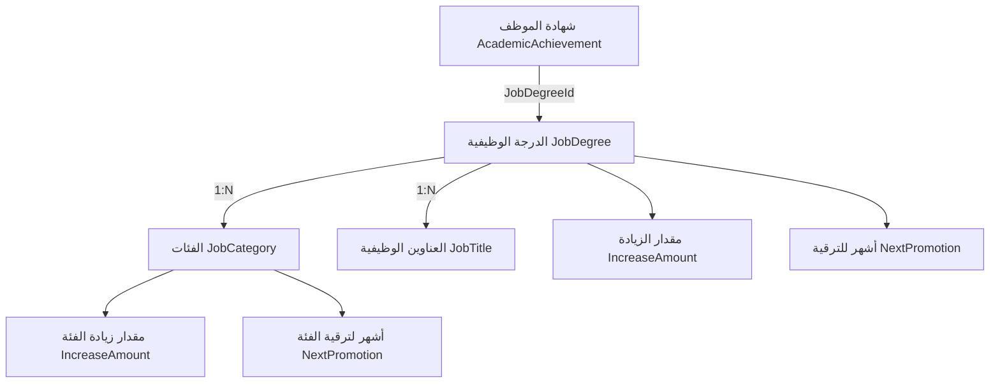
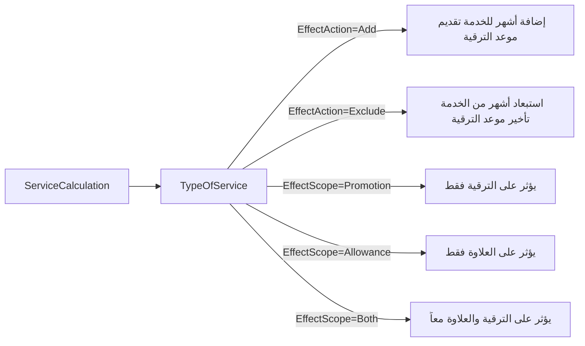
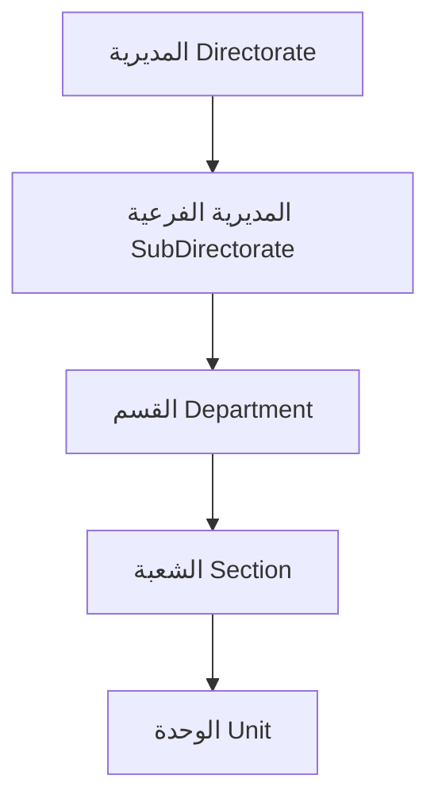
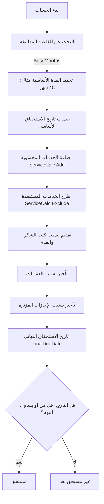

# نظام إدارة الموارد البشرية (HRM) — التوثيق التفصيلي الكامل

> **مصدر هذا التوثيق:** تحليل عميق للكود المصدري (Backend: .NET Clean Architecture + Frontend: Next.js).  
> **تاريخ التحليل:** 2026-08-10

---

## الفهرس

1. [المعمارية العامة للنظام](#1-المعمارية-العامة-للنظام)
2. [البيانات التأسيسية للموظف (Employee Core)](#2-البيانات-التأسيسية-للموظف)
3. [نظام الشهادات والدرجات — ربط التحصيل الدراسي بالدرجة الوظيفية](#3-نظام-الشهادات-والدرجات)
4. [نظام الترقيات الوظيفية (Promotion Engine)](#4-نظام-الترقيات-الوظيفية)
5. [نظام العلاوات السنوية (Annual Allowance Engine)](#5-نظام-العلاوات-السنوية)
6. [نظام علاوات الترفيع (Promotion Allowance Engine)](#6-نظام-علاوات-الترفيع)
7. [نظام حساب الخدمة (Service Calculation)](#7-نظام-حساب-الخدمة)
8. [نظام الإجازات والغيابات](#8-نظام-الإجازات-والغيابات)
9. [نظام كتب الشكر والقدم](#9-نظام-كتب-الشكر-والقدم)
10. [نظام العقوبات والانضباط](#10-نظام-العقوبات-والانضباط)
11. [نظام تصحيح التحصيل الدراسي](#11-نظام-تصحيح-التحصيل-الدراسي)
12. [نظام تغيير الدرجة والعنوان الوظيفي](#12-نظام-تغيير-الدرجة-والعنوان-الوظيفي)
13. [الهيكل التنظيمي والتنسيب والنقل](#13-الهيكل-التنظيمي-والتنسيب-والنقل)
14. [نظام الإجازات الدراسية](#14-نظام-الإجازات-الدراسية)
15. [نظام التقاعد والاستقالة ونهاية الخدمة](#15-نظام-التقاعد-والاستقالة-ونهاية-الخدمة)
16. [نظام الشهداء والجرحى](#16-نظام-الشهداء-والجرحى)
17. [أنظمة مساندة (التقييم، الدورات، الوثائق، الأوامر الإدارية)](#17-أنظمة-مساندة)
18. [جميع القيم المُعرَّفة (Enums)](#18-جميع-القيم-المعرّفة)
19. [مخططات العلاقات (ER Diagrams)](#19-مخططات-العلاقات)

---

## 1. المعمارية العامة للنظام

### البنية البرمجية (Clean Architecture)

| الطبقة | المشروع | الوظيفة |
|---|---|---|
| **Domain** | `HRM.Hub.Domain` | الكيانات (Entities)، الأنواع (Enums)، القواعد الأساسية |
| **Application** | `HRM.Hub.Application` | الأوامر والاستعلامات (CQRS)، Business Logic، التحقق (Validation) |
| **Persistence** | `HRM.Hub.Persistence` | قاعدة البيانات (EF Core)، المستودعات (Repositories) |
| **Controllers** | `HRM.Hub.Controllers` | واجهة REST API |
| **Frontend** | `Hr-Frontend` | واجهة المستخدم (Next.js + TypeScript) |

### الكيان الأساسي (`BaseEntity<T>`)

كل كيان في النظام يرث من `BaseEntity<T>` ويمتلك الحقول التالية:

| الحقل | النوع | الوظيفة |
|---|---|---|
| `Id` | `T` (Guid أو int) | المفتاح الرئيسي |
| `StatusId` | `Status` (Enum) | حالة السجل (فعال/غير فعال/مؤرشف...) |
| `CreateAt` | `DateTime` | تاريخ الإنشاء |
| `CreateBy` | `Guid?` | معرّف المستخدم المنشئ |
| `LastUpdateAt` | `DateTime?` | تاريخ آخر تعديل |
| `LastUpdateBy` | `Guid?` | معرّف المستخدم المعدّل |
| `IsDeleted` | `bool` | حذف ناعم (Soft Delete) |
| `DeletedAt` | `DateTime?` | تاريخ الحذف |
| `DeletedBy` | `Guid?` | معرّف المستخدم الذي حذف |
| `DoneProcdureDate` | `DateTime?` | تاريخ إتمام الإجراء |

---

## 2. البيانات التأسيسية للموظف

### كيان الموظف (`Employees`)

#### الأرقام المميزة (Unique Indexes)

| الحقل | الاسم | الوصف |
|---|---|---|
| `StatisticalIndex` | الرقم الإحصائي | رقم فريد لا يتكرر لأي موظف |
| `JobCode` | الرمز الوظيفي | رمز فريد للوظيفة |
| `LotNumber` | رقم القرعة | رقم فريد |

#### البيانات الشخصية

| الحقل | النوع | الوصف |
|---|---|---|
| `FirstName` | string | الاسم الأول |
| `SecondName` | string | اسم الأب |
| `ThirdName` | string | اسم الجد |
| `FourthName` | string | الاسم الرابع |
| `SurName` | string | اللقب |
| `FullName` | string | الاسم الكامل (محسوب/مجمّع) |
| `MotherFirstName` | string | اسم الأم الأول |
| `MotherSecondName` | string | اسم أب الأم |
| `MotherThirdName` | string | اسم جد الأم |
| `MotherSurName` | string | لقب الأم |
| `MotherFullName` | string | اسم الأم الكامل |
| `Gender` | `GenderEnum` | الجنس (ذكر=1 / أنثى=2) |
| `BirthPlace` | string | محل الولادة |
| `BirthDate` | `DateOnly?` | تاريخ الولادة |
| `SocialStatus` | `SocialStatusEnum` | الحالة الاجتماعية |
| `Nationalism` | string | القومية |
| `Religion` | string | الديانة |
| `CountryId` | int? | البلد |
| `IsPinned` | bool | تثبيت الموظف (مفضل) |
| `StatusWorkingId` | `WorkingStatusEnum` | حالة العمل الحالية |
| `Notes` | string | ملاحظات |

#### حالة العمل (`WorkingStatusEnum`) — القيم المحددة

| القيمة | المعنى بالعربية | الوصف |
|---|---|---|
| `Active` (0) | مستمر في الخدمة | الموظف يعمل حالياً |
| `Deceased` (1) | متوفي | الموظف متوفى (غير شهيد) |
| `Martyr` (2) | شهيد | الموظف استشهد |
| `Resigned` (3) | استقالة | قدّم استقالته |
| `Transferred` (4) | نقل خدمات | نُقلت خدماته لجهة أخرى |
| `Retired` (5) | تقاعد | أُحيل على التقاعد |
| `Dismissed` (6) | عزل | عُزل من الخدمة |
| `Interrupted` (7) | خدمة مقطوعة | الخدمة منقطعة |
| `Copied` (8) | خدمة منسوخة | الخدمة منسوخة |

---

## 3. نظام الشهادات والدرجات

### العلاقة الحاسمة: الشهادة ← الدرجة الوظيفية

في النظام، كل **تحصيل دراسي** (`AcademicAchievement`) مرتبط مباشرة بـ **درجة وظيفية** (`JobDegree`) عبر الحقل `JobDegreeId`.

```
AcademicAchievement (التحصيل الدراسي)
├── Id (int)
├── Name (string) ← اسم الشهادة (ابتدائية، متوسطة، إعدادية، بكالوريوس، ماجستير، دكتوراه...)
└── JobDegreeId (int?) ← FK → JobDegree ★ الدرجة التي يُعيّن عليها حامل هذه الشهادة
```

**هذا يعني:** عندما يتم تعيين موظف بشهادة ابتدائية مثلاً، يقوم النظام تلقائياً بتحديد الدرجة الوظيفية التي يُعيّن عليها من خلال جدول `AcademicAchievement` وعلاقته بـ `JobDegree`.

### الدرجة الوظيفية (`JobDegree`)

| الحقل | النوع | الوصف |
|---|---|---|
| `Id` | int | معرّف الدرجة |
| `Name` | string | اسم الدرجة (مثال: الدرجة العاشرة، التاسعة...) |
| `Index` | int | الترتيب التسلسلي للدرجة |
| `IncreaseAmount` | decimal | **مقدار الزيادة المالية** عند الترقية لهذه الدرجة |
| `NextPromotion` | int | **عدد الأشهر** المطلوبة للترقية إلى الدرجة التالية |

**مثال مفاهيمي** (القيم الفعلية في قاعدة البيانات):
| الشهادة (AcademicAchievement.Name) | الدرجة (JobDegree) | أشهر للترقية التالية |
|---|---|---|
| ابتدائية | الدرجة العاشرة | `NextPromotion` شهر |
| متوسطة | الدرجة التاسعة | `NextPromotion` شهر |
| إعدادية | الدرجة الثامنة | `NextPromotion` شهر |
| دبلوم | الدرجة السابعة | `NextPromotion` شهر |
| بكالوريوس | الدرجة السادسة | `NextPromotion` شهر |
| ماجستير | الدرجة الخامسة | `NextPromotion` شهر |
| دكتوراه | الدرجة الرابعة | `NextPromotion` شهر |

### الفئة الوظيفية (`JobCategory`)

لكل درجة وظيفية عدة **فئات** (مراحل فرعية داخل الدرجة):

| الحقل | النوع | الوصف |
|---|---|---|
| `Id` | int | معرّف الفئة |
| `DegreeId` | int | FK → الدرجة الأم |
| `Name` | string | اسم الفئة (أ، ب، ج، د...) |
| `Index` | int | الترتيب التسلسلي |
| `IncreaseAmount` | decimal | **مقدار الزيادة المالية** عند الترقية داخل الفئة |
| `NextPromotion` | int | **عدد الأشهر** المطلوبة للترقية إلى الفئة التالية |

### العنوان الوظيفي (`JobTitle`)

| الحقل | النوع | الوصف |
|---|---|---|
| `Id` | int | معرّف العنوان |
| `DegreeId` | int | FK → مرتبط بدرجة وظيفية معينة |
| `Name` | string | اسم العنوان (كاتب، مهندس، محاسب...) |

### التوصيف الوظيفي (`JobDescription`)

| الحقل | النوع | الوصف |
|---|---|---|
| `Id` | int | معرّف التوصيف |
| `Name` | string | وصف الوظيفة |

### آلية الربط الكاملة



---

## 4. نظام الترقيات الوظيفية

### سجل الترقية الحالي (`Promotion`)

لكل موظف سجل ترقية واحد يمثل وضعه الحالي:

| الحقل | النوع | الوصف |
|---|---|---|
| `Id` | Guid | = EmployeeId (علاقة 1:1) |
| `JobDegreeId` | int | الدرجة الوظيفية الحالية |
| `JobCategoryId` | int | الفئة الحالية |
| `DueDateDegree` | DateOnly? | **تاريخ استحقاق ترقية الدرجة** |
| `DueDateCategory` | DateOnly? | **تاريخ استحقاق ترقية الفئة** |
| `LastAllowanceDate` | DateOnly? | تاريخ آخر علاوة |
| `StopPromotion` | bool | **إيقاف الترقية** (بسبب عقوبة أو إجراء) |
| `ServiceRecycle` | int? | إعادة حساب الخدمة |
| `SentPromotionGroupId` | long? | معرّف دفعة الترفيع المُرسلة |
| `Note` | string | ملاحظات |

### آلية الترقية — كيف يعمل النظام

1. **حساب تاريخ الاستحقاق:**
   - `DueDateDegree = تاريخ آخر ترقية درجة + JobDegree.NextPromotion شهر`
   - `DueDateCategory = تاريخ آخر ترقية فئة + JobCategory.NextPromotion شهر`
   
2. **تعديلات على تاريخ الاستحقاق** (تقديم أو تأخير):
   - **كتب الشكر والقدم** → تُقدّم موعد الترقية
   - **العقوبات الانضباطية** → تؤخّر موعد الترقية (عدد أيام تأخير)
   - **الإجازات المؤثرة** → قد تؤخّر موعد الترقية
   - **خدمات إضافية محسوبة** → قد تُقدّم أو تُؤخّر

3. **إيقاف الترقية (`StopPromotion = true`):**
   - يمكن إيقاف ترقية الموظف بسبب عقوبة أو مخالفة مع تسجيل السبب في `LogPromotionWithholding`
   
4. **دفعات الترفيع (`PromotionGroup`):**
   - يتم تجميع الموظفين المستحقين في **دفعة ترفيع** واحدة
   - لكل دفعة: `GroupName`، `GroupSendDate` (تاريخ الإرسال)، `GroupDoneDate` (تاريخ الإنجاز)، `CountEmployee` (عدد الموظفين)

### سجل تاريخ الترقيات (`PromotionLogs`)

يُسجّل كل ترقية سابقة بالتفصيل:

| الحقل | الوصف |
|---|---|
| `JobDegreeFromId` / `JobDegreeToId` | من درجة → إلى درجة |
| `JobCategoryFromId` / `JobCategoryToId` | من فئة → إلى فئة |
| `JobTitleFromId` / `JobTitleToId` | من عنوان → إلى عنوان |
| `DueDateDegreeFrom` / `DueDateDegreeTo` | تاريخ استحقاق الدرجة قبل/بعد |
| `DueDateCategoryFrom` / `DueDateCategoryTo` | تاريخ استحقاق الفئة قبل/بعد |
| `AdministrativeOrderNo` / `Date` | رقم وتاريخ الأمر الإداري |
| `MinistryOfFinanceBookNo` / `Date` | رقم وتاريخ كتاب وزارة المالية |

### سجل حجب الترفيع (`LogPromotionWithholding`)

| الحقل | الوصف |
|---|---|
| `ScheduledPromotionDate` | تاريخ الترقية المقررة |
| `WithholdingDate` | تاريخ الحجب |
| `ReasonForWithholding` | سبب حجب الترقية |

---

## 5. نظام العلاوات السنوية

### قواعد العلاوة السنوية (`AnnualAllowanceRule`)

تُحدد مدة الانتظار للعلاوة بناءً على مزيج من:

| الحقل | النوع | الوصف |
|---|---|---|
| `JobDegreeId` | int? | الدرجة الوظيفية (اختياري) |
| `JobCategoryId` | int? | الفئة (اختياري) |
| `AcademicAchievementId` | int? | التحصيل الدراسي (اختياري) |
| `ApplicableLawId` | int? | القانون المُطبَّق (اختياري) |
| `BaseMonths` | int | **عدد الأشهر الأساسية** للاستحقاق |
| `Priority` | int | أولوية تطبيق القاعدة (الأعلى أولاً) |
| `IsActive` | bool | هل القاعدة فعالة؟ |

**آلية العمل:** النظام يبحث عن القاعدة الأكثر تطابقاً مع وضع الموظف (درجته، فئته، شهادته، قانونه) ويُطبّق الـ `BaseMonths` منها.

### حساب العلاوة السنوية (`AnnualAllowanceCalculationRun`)

| الحقل | النوع | الوصف |
|---|---|---|
| `LastAllowanceDate` | DateOnly | تاريخ آخر علاوة |
| `LegalTermMonths` | int | المدة القانونية بالأشهر (من القاعدة) |
| `ServiceMonths` | int | أشهر الخدمة الفعلية |
| `BaseDate` | DateOnly | تاريخ البدء الأساسي |
| `BaseDueDate` | DateOnly | تاريخ الاستحقاق الأساسي (قبل التعديلات) |
| `FinalDueDate` | DateOnly | **تاريخ الاستحقاق النهائي** (بعد كل التعديلات) |
| `AnnualAllowanceStatus` | Enum | حالة الاستحقاق |
| `Summary` | string | ملخص نصي للحساب |
| `Trigger` | string | ما الذي أطلق الحساب |

### خطوات الحساب (`AnnualAllowanceCalculationDetail`)

كل خطوة في عملية الحساب مُسجّلة بدقة:

| الحقل | الوصف |
|---|---|
| `StepCode` | نوع الخطوة (انظر القيم أدناه) |
| `SourceEntityName` | اسم الكيان المصدر (مثلاً: Leave, Disciplinary) |
| `SourceEntityId` | معرّف السجل المصدر |
| `Reason` | سبب التعديل |
| `BeforeDate` / `AfterDate` | التاريخ قبل وبعد التعديل |
| `DeltaMonths` / `DeltaDays` | **الفرق** (+ تقديم / - تأخير) |

#### أنواع خطوات الحساب (`AnnualAllowanceStepCode`)

| القيمة | المعنى | التأثير |
|---|---|---|
| `BaseRule` (1) | القاعدة الأساسية | تحديد المدة القانونية |
| `ActualService` (2) | الخدمة الفعلية | حساب الخدمة الفعلية |
| `ServiceAdd` (3) | إضافة خدمة | تقديم تاريخ الاستحقاق |
| `ServiceExclude` (4) | استبعاد خدمة | تأخير تاريخ الاستحقاق |
| `Leave` (5) | إجازة مؤثرة | تأخير بسبب إجازة |
| `Penalty` (6) | عقوبة | تأخير بسبب عقوبة انضباطية |
| `Seniority` (7) | قِدَم | تقديم بسبب كتب القِدَم |
| `PromotionImpact` (8) | تأثير الترفيع | تعديل بسبب ترقية حديثة |
| `Thanks` (9) | شكر | تقديم بسبب كتب الشكر |

### حالات استحقاق العلاوة (`AnnualAllowanceStatus`)

| القيمة | المعنى |
|---|---|
| `Eligible` (1) | مستحق |
| `NotEligible` (2) | غير مستحق |
| `DeferredPenalty` (3) | مؤجل بسبب عقوبة |
| `DeferredLeave` (4) | مؤجل بسبب إجازة |
| `AwaitingService` (5) | بانتظار اكتمال الخدمة |
| `SuspendedTerminated` (6) | موقوف/منهي الخدمة |
| `Draft` (7) | مسودة |
| `PendingApproval` (8) | بانتظار الموافقة |
| `Approved` (9) | معتمدة |
| `Issued` (10) | صادرة |
| `Cancelled` (11) | ملغية |

### سجل العلاوة السنوية (`AnnualAllowanceRecord`)

| الحقل | الوصف |
|---|---|
| `DueDate` | تاريخ الاستحقاق |
| `ImplementationDate` | تاريخ التنفيذ الفعلي |
| `BonusTypeId` | نوع العلاوة |
| `ReasonForAmendment` | سبب التعديل (إن وُجد) |
| `AdministrativeOrderNo` / `Date` | رقم وتاريخ الأمر الإداري |
| `UserId` / `EnteredDate` | من أدخل السجل ومتى |
| `CalculationRunId` | ربط بعملية الحساب |

---

## 6. نظام علاوات الترفيع

### قواعد علاوة الترفيع (`PromotionAllowanceRule`)

مشابهة لقواعد العلاوة السنوية ولكن خاصة بالترقيات:

| الحقل | الوصف |
|---|---|
| `CalculationKind` | نوع الحساب: `Promotion` (1) أو `Allowance` (2) |
| `JobDegreeId` | الدرجة |
| `JobCategoryId` | الفئة |
| `AcademicAchievementId` | التحصيل الدراسي |
| `ApplicableLawId` | القانون |
| `BaseMonths` | **عدد الأشهر الأساسية** |
| `Priority` | الأولوية |

### حساب علاوة الترفيع (`PromotionAllowanceCalculationRun`)

| الحقل | الوصف |
|---|---|
| `PromotionBaseDate` | تاريخ بدء حساب الترقية |
| `PromotionBaseMonths` | الأشهر الأساسية للترقية |
| `PromotionDueDate` | **تاريخ استحقاق الترقية النهائي** |
| `AllowanceBaseDate` | تاريخ بدء حساب العلاوة |
| `AllowanceBaseMonths` | الأشهر الأساسية للعلاوة |
| `AllowanceDueDate` | **تاريخ استحقاق العلاوة النهائي** |
| `Summary` | ملخص نصي |
| `Trigger` | سبب الحساب |

### خطوات حساب الترفيع (`PromotionAllowanceCalculationDetail`)

| الحقل | الوصف |
|---|---|
| `CalculationKind` | `Promotion` أو `Allowance` |
| `StepCode` | رمز الخطوة |
| `SourceEntityName` / `SourceEntityId` | المصدر |
| `Reason` | السبب |
| `BeforeDate` / `AfterDate` | قبل/بعد |
| `DeltaMonths` / `DeltaDays` | مقدار التعديل |

---

## 7. نظام حساب الخدمة

### أنواع الخدمة (`TypeOfService`)

| الحقل | النوع | الوصف |
|---|---|---|
| `Name` | string | اسم نوع الخدمة |
| `EffectAction` | `ServiceEffectAction` | تأثير الخدمة: `None`(0) / `Add`(1) / `Exclude`(2) |
| `EffectScope` | `PromotionAllowanceEffectScope` | نطاق التأثير: `None`(0) / `Promotion`(1) / `Allowance`(2) / `Both`(3) |

### سجل حساب الخدمة (`ServiceCalculation`)

| الحقل | الوصف |
|---|---|
| `TypeOfServiceId` | نوع الخدمة |
| `CountOfMonth` | **عدد الأشهر** المُضافة أو المستبعدة |
| `OrderNo` / `OrderDate` | رقم وتاريخ الأمر |
| `IsPoliticalTermination` | هل الفصل سياسي؟ |

### آلية التأثير على الترقيات والعلاوات



---

## 8. نظام الإجازات والغيابات

### كيان الإجازة (`Leaves`) — الحقول التفصيلية

#### بيانات أساسية

| الحقل | النوع | الوصف |
|---|---|---|
| `TypeOfLeaveId` | int | FK → نوع الإجازة (من الجدول المُعرّف) |
| `LegacyTypeOfLeaveId` | `LeaveTypes` | نوع الإجازة (Enum قديم) |
| `NormalLeaveTypeId` | int? | نوع فرعي للإجازة الاعتيادية |
| `SicknessTypeId` | int? | نوع المرض (للإجازات المرضية) |
| `LongLeaveTypeId` | int? | نوع الإجازة الطويلة |
| `LeaveStatusId` | `LeaveStatus` | حالة الإجازة (مسودة/بانتظار/معتمدة...) |
| `FromDate` / `ToDate` | DateOnly? | فترة الإجازة |
| `CountOfDays` | int? | عدد الأيام |
| `CountOfMinutes` | int? | عدد الدقائق (للزمنية) |
| `SalaryStatusId` | `SalaryStatus` | حالة الراتب أثناء الإجازة |
| `IsInside` | bool? | إجازة داخل البلد أم خارجه |
| `CountryId` | int? | بلد الإجازة |

#### تأثيرات الإجازة على الترقية والعلاوة

| الحقل | النوع | الوصف |
|---|---|---|
| `AffectsPromotion` | bool? | **هل تؤثر على موعد الترقية؟** |
| `AffectsAllowance` | bool? | **هل تؤثر على موعد العلاوة؟** |
| `DelayDaysOverride` | int? | عدد أيام التأخير المخصص (override) |
| `DelayWholeDuration` | bool | هل يتم تأخير كامل مدة الإجازة؟ (الافتراضي: نعم) |

#### أوامر إدارية مرتبطة

| الحقل | الوصف |
|---|---|
| `OrderNo` / `OrderDate` | أمر الإجازة |
| `HireOrderNo` / `HireOrderDate` / `HireDate` | أمر المباشرة والعودة |
| `NoOfRelease` / `DateOfRelease` / `ReleaseDate` | أمر الإطلاق |
| `NoOfPermission` / `DateOfPermission` | أمر الإذن |
| `NoOfBirthCertificate` / `DateOfBirthCertificate` | شهادة الولادة (لإجازة الأمومة) |

#### دورة حياة الإجازة (Workflow)

| الحقل | الوصف |
|---|---|
| `SubmittedAt` | تاريخ التقديم |
| `ApprovedAt` | تاريخ الموافقة |
| `RejectedAt` | تاريخ الرفض |
| `ActivatedAt` | تاريخ التفعيل |
| `ExpiredAt` | تاريخ الانتهاء |
| `CancelledAt` | تاريخ الإلغاء |
| `ApproverId` | مُعرّف الموافِق |
| `ApprovalNote` | ملاحظة الموافقة |
| `CutReason` | سبب القطع |

#### حالات الإجازة (`LeaveStatus`)

| القيمة | المعنى |
|---|---|
| `Draft` (0) | مسودة |
| `PendingApproval` (1) | بانتظار الموافقة |
| `Approved` (2) | معتمدة |
| `Rejected` (3) | مرفوضة |
| `Active` (4) | نشطة (جارية) |
| `Expired` (5) | منتهية |
| `Cancelled` (6) | ملغية |

### أنواع الإجازات (`LeaveTypes` Enum)

| القيمة | المعنى بالعربية |
|---|---|
| `Unknown` (0) | غير معرف |
| `NormalLeave` (1) | إجازة اعتيادية |
| `PartialLeave` (2) | زمنية (بالدقائق/الساعات) |
| `SicknessLeave` (3) | إجازة مرضية |
| `MotherhoodBornLeave` (4) | الأمومة والوضع |
| `LongLeave` (5) | إجازة طويلة |
| `TravelLeave` (6) | إجازة سفر |
| `SpecialSicknessLeave` (7) | إجازة مرضية خاصة |
| `AppointeeLeave` (8) | إجازة المعيّن |
| `MourningLeave` (9) | إجازة العدة |

### نوع الإجازة المُعرّف بالجدول (`TypeOfLeave`) — خصائص وسلوكيات

| الحقل | النوع | الوصف |
|---|---|---|
| `MaxDurationDays` | int? | الحد الأقصى لعدد الأيام |
| `RequiresAdministrativeOrder` | bool | تتطلب أمر إداري؟ |
| `RequiresApprovals` | bool | تتطلب موافقات؟ |
| `AffectsService` | bool | **تؤثر على حساب الخدمة؟** |
| `AffectsPromotion` | bool | **تؤثر على الترقية؟** |
| `AffectsBonus` | bool | **تؤثر على العلاوة؟** |
| `AffectsSalary` | bool | **تؤثر على الراتب؟** |
| `AffectsRetirement` | bool | **تؤثر على التقاعد؟** |
| `AllowsExtension` | bool | قابلة للتمديد؟ |
| `AllowsTermination` | bool | قابلة للقطع؟ |
| `AllowsCarryover` | bool | قابلة للترحيل؟ |
| `CountsTowardsAnnualBalance` | bool | تُحسب من الرصيد السنوي؟ |
| `IsBalanceBased` | bool | مبنية على رصيد؟ |
| `MaxCarryoverDays` | int? | أقصى أيام للترحيل |
| `DefaultSalaryStatusId` | `SalaryStatus` | حالة الراتب الافتراضية |

### حالة الراتب أثناء الإجازة (`SalaryStatus`)

| القيمة | المعنى |
|---|---|
| `NotSpecified` (0) | غير محدد |
| `WithSalary` (1) | **براتب كامل** |
| `WithoutSalary` (2) | **بدون راتب** |
| `NominalSalary` (3) | **براتب اسمي** |
| `HalfNominalSalary` (4) | **بنصف الراتب الاسمي** |
| `HalfAndNominalSalary` (5) | **نصف راتب اسمي + راتب اسمي** |

### رصيد الإجازات (`LeavesBalance`)

| الحقل | النوع | الوصف |
|---|---|---|
| `Balance` | int? | الرصيد الكلي (Legacy) |
| `AnnualBalance` | int | الرصيد السنوي المُخصص |
| `CarriedOverBalance` | int | الرصيد المُرحّل من العام السابق |
| `EarnedBalance` | int | الرصيد المُكتسب |
| `UsedBalance` | int | الرصيد المُستخدم |
| `RemainingBalance` | **محسوب** | = `AnnualBalance + CarriedOverBalance + EarnedBalance - UsedBalance` |

### الرصيد المرضي (`LeavesMedicalBalance`)

| الحقل | النوع | الوصف |
|---|---|---|
| `Balance` | double? | الرصيد المرضي المتبقي |

### الغياب (`Absence`)

| الحقل | الوصف |
|---|---|
| `AbsenceDate` | تاريخ الغياب |
| `CountOfDays` | عدد أيام الغياب |
| `BookNo` / `BookDate` | رقم وتاريخ الكتاب |
| `AbsenceOrderNo` / `AbsenceOrderDate` | أمر الغياب |
| `ReturnOrderNo` / `ReturnOrderDate` | أمر العودة |

### الانقطاع (`Interruption`)

| الحقل | الوصف |
|---|---|
| `NotificationDate` | تاريخ الإشعار |
| `StartDate` / `EndDate` | بداية ونهاية الانقطاع |
| `Reason` | سبب الانقطاع |

### سحب اليد (`HandPull`)

| الحقل | الوصف |
|---|---|
| `WithdrawHandPullOrderNo` / `Date` | أمر سحب اليد |
| `RaiseHandPullOrderNo` / `Date` | أمر رفع سحب اليد |

---

## 9. نظام كتب الشكر والقدم

### كيان الشكر والقِدَم (`ThanksAndSeniority`)

| الحقل | النوع | الوصف |
|---|---|---|
| `TypeOfBookId` | int | نوع الكتاب (شكر/تقدير...) |
| `TypeOfSeniorityId` | int | نوع القِدَم (أشهر إضافية) |
| `BookNo` | string | رقم الكتاب |
| `DateOfBook` | DateOnly | تاريخ الكتاب |
| `BookIssueName` | string | جهة إصدار الكتاب |
| `Reason` | string | سبب الشكر |
| `CountOfMonths` | int | **عدد أشهر القِدَم** المُمنوحة |
| `IsDocumentVerify` | bool? | هل تم التحقق من الوثيقة؟ |
| `CalculationDate` | DateOnly? | تاريخ الاحتساب |
| `IsCalculation` | bool? | هل تم الاحتساب؟ |
| `IsConsumed` | bool | **هل تم استهلاكه في حساب ترقية/علاوة؟** |
| `ConsumedAt` | DateTime? | تاريخ الاستهلاك |
| `ConsumedCalculationRunId` | Guid? | ربط بعملية الحساب التي استهلكته |

**آلية التأثير:**
- كل كتاب شكر يمنح الموظف `CountOfMonths` أشهر إضافية من القِدَم
- هذه الأشهر تُقدّم تاريخ استحقاق الترقية والعلاوة
- بمجرد استهلاكها في عملية حساب، تُعلّم بـ `IsConsumed = true` لمنع الاستخدام المزدوج

---

## 10. نظام العقوبات والانضباط

### نوع العقوبة (`TypeOfDisciplinary`)

| الحقل | النوع | الوصف |
|---|---|---|
| `Name` | string | اسم العقوبة (إنذار، لفت نظر، حسم راتب...) |
| `CountOfDayDelay` | int | **عدد أيام التأخير الافتراضي** |
| `AffectsPromotion` | bool | **هل تؤثر على الترقية؟** |
| `AffectsAllowance` | bool | **هل تؤثر على العلاوة؟** |
| `DefaultDelayDays` | int? | أيام التأخير الافتراضية |

### عقوبة الموظف (`EmployeeDisciplinary`)

| الحقل | النوع | الوصف |
|---|---|---|
| `TitleOfBook` | string | عنوان الكتاب |
| `TypeOfDisciplinaryId` | int | نوع العقوبة |
| `BookNo` | string | رقم الكتاب |
| `BookDate` | DateOnly? | تاريخ الكتاب |
| `StopPromotion` | bool? | **هل توقف الترقية بالكامل؟** |
| `CountOfDayDelay` | int? | **عدد أيام التأخير** (يُمكن تخصيصه per-record) |
| `DisciplinaryLaw` | string | القانون المُطبَّق |
| `Reason` | string | سبب العقوبة |

**آلية التأثير على الترقية:**
1. إذا `StopPromotion = true` → يتم إيقاف ترقية الموظف بالكامل (وتسجيل ذلك في `LogPromotionWithholding`)
2. إذا `StopPromotion = false` و `CountOfDayDelay > 0` → يتم تأخير موعد الترقية/العلاوة بعدد الأيام المحددة
3. التأثير على الترقية أو العلاوة أو كليهما يعتمد على `TypeOfDisciplinary.AffectsPromotion` و `AffectsAllowance`

---

## 11. نظام تصحيح التحصيل الدراسي

عندما يحصل الموظف على شهادة جديدة أعلى أثناء الخدمة (مثلاً: حصل على بكالوريوس وهو مُعيّن على شهادة إعدادية):

### كيان التصحيح (`CorrectingAcademicAchievements`)

| الحقل | الوصف |
|---|---|
| `DegreeFromId` / `DegreeToId` | من الدرجة → إلى الدرجة الجديدة |
| `JobCategoryFromId` / `JobCategoryToId` | من الفئة → إلى الفئة الجديدة |
| `JobTitleFromId` / `JobTitleToId` | من العنوان → إلى العنوان الجديد |
| `JobDescriptionFromId` / `JobDescriptionToId` | من التوصيف → إلى التوصيف الجديد |
| `DueDateDegree` | تاريخ استحقاق الدرجة الجديدة |
| `DueDateCategory` | تاريخ استحقاق الفئة الجديدة |
| `AcademicAchievementId` | الشهادة الجديدة |
| `IsCertificateCalculation` | هل تم احتساب الشهادة؟ |
| `BookNo` / `BookDate` | رقم وتاريخ أمر التصحيح |

**آلية العمل:**
- يُسجّل الوضع السابق (From) والوضع الجديد (To) بالكامل
- يُعدّل درجة الموظف وفئته وعنوانه بناءً على الشهادة الجديدة
- يُعاد حساب تاريخ الاستحقاق

---

## 12. نظام تغيير الدرجة والعنوان الوظيفي

### تغيير الدرجة والفئة (`ChangeDegrees`)

| الحقل | الوصف |
|---|---|
| `JobDegreeFromId` / `JobDegreeToId` | من درجة → إلى درجة |
| `JobCategoryFromId` / `JobCategoryToId` | من فئة → إلى فئة |
| `JobTitleFromId` / `JobTitleToId` | من عنوان → إلى عنوان |
| `JobDescriptionFromId` / `JobDescriptionToId` | من توصيف → إلى توصيف |
| `OldDegreeDueDate` / `NewDegreeDueDate` | تاريخ استحقاق الدرجة قبل/بعد |
| `OldCategoryDueDate` / `NewCategoryDueDate` | تاريخ استحقاق الفئة قبل/بعد |
| `OrderNo` / `OrderDate` | رقم وتاريخ الأمر |

### تغيير العنوان الوظيفي (`ChangeJobTitle`)

| الحقل | الوصف |
|---|---|
| `NewJobTitleId` / `OldJobTitleId` | العنوان الجديد/القديم |
| `NewJobDescriptionId` / `OldJobDescriptionId` | التوصيف الجديد/القديم |
| `OrderNo` / `OrderDate` | رقم وتاريخ الأمر |

### تغيير تاريخ الاستحقاق (`ChangeDueDates`)

| الحقل | الوصف |
|---|---|
| `CurrentDegreeDueDate` / `NewDegreeDueDate` | تاريخ استحقاق الدرجة الحالي/الجديد |
| `CurrentCategoryDueDate` / `NewCategoryDueDate` | تاريخ استحقاق الفئة الحالي/الجديد |
| `OrderNo` / `OrderDate` | رقم وتاريخ الأمر |

---

## 13. الهيكل التنظيمي والتنسيب والنقل

### الهيكل التنظيمي (هرمية 5 مستويات)



### المعلومات الإدارية (`ManagementInformation`)

| الحقل | النوع | الوصف |
|---|---|---|
| `DirectorateId` | int | المديرية |
| `SubDirectorateId` | int? | المديرية الفرعية |
| `DepartmentId` | int? | القسم |
| `PositionId` | int | الموقع/المنصب |
| `EmploymentDegreeId` | int | **درجة التعيين** (FK → JobDegree) |
| `StopJobDegreeId` | int? | **درجة توقف الترقية** |
| `JobTitleId` | int | العنوان الوظيفي |
| `JobDescriptionId` | int | التوصيف الوظيفي |
| `IsCurrent` | bool | هل هي المعلومات الحالية؟ |
| `IsInHiring` | bool | هل عند التعيين؟ |

### منصب الموظف (`EmployeePosition`)

| الحقل | النوع | الوصف |
|---|---|---|
| `EmployeePositionType` | Enum | نوع المنصب: `Original`(0) / `Acting`(1) |
| `DirectorateId` → `UnitId` | int? | الموقع الإداري الكامل |
| `PositionId` | int? | المنصب |
| `StartDate` | DateOnly? | تاريخ البدء |
| `AssignedOrderNo` / `Date` | | أمر التكليف |
| `EndAssignedOrderNo` / `Date` | | أمر إنهاء التكليف |
| `AdministrativeOrderNo` / `Date` | | الأمر الإداري |

### حركات النقل (`Movements`)

| الحقل | الوصف |
|---|---|
| `FromDirectorateId` → `FromUniteId` | الموقع المنقول منه (5 مستويات) |
| `ToDirectorateId` → `ToUnitId` | الموقع المنقول إليه (5 مستويات) |
| `OrderNo` / `OrderDate` | أمر النقل |
| `ReleaseOrderNo` / `ReleaseOrderDate` / `ReleaseDate` | أمر الإطلاق |
| `HireOrderNo` / `HireOrderDate` / `HireDate` | أمر المباشرة |

### التنسيب (`Assignments`)

| الحقل | الوصف |
|---|---|
| `TypeOfAssignmentId` | نوع التنسيب |
| `AssignmentSite` | `Internal`(0) / `External`(1) |
| `AssignedFromOrganization` / `ToOrganization` | الجهة المنسّب منها/إليها |
| `DurationOfAssignment` | مدة التنسيب |
| `ExtensionDate` / `ExtensionReason` | تمديد التنسيب |
| أوامر الإطلاق والمباشرة والإنهاء | مجموعة كاملة من الأوامر الإدارية |

### الارتباط (`Affiliation`)

| الحقل | الوصف |
|---|---|
| `AssignmentSite` | `Internal`(0) / `External`(1) |
| `OriginalEntity` | الجهة الأصلية |
| `Ministry` | الوزارة |
| `ReasonForJoining` | سبب الالتحاق |
| `DurationMonths` | المدة بالأشهر |
| `FromDate` / `ToDate` | فترة الارتباط |
| `RenewalCount` / `MaxRenewals` | عدد التجديدات / الحد الأقصى |

---

## 14. نظام الإجازات الدراسية

### الإجازة الدراسية (`StudyLeave`)

| الحقل | النوع | الوصف |
|---|---|---|
| `StudyFileId` | Guid? | ملف الدراسة |
| `AcademicCertificateTypeId` | int? | نوع الشهادة الأكاديمية |
| `AcademicAchievementId` | int? | التحصيل الدراسي المطلوب |
| `AcademicFieldId` | int? | التخصص |
| `StudyPeriodTime` | int? | مدة الدراسة |
| `AcceptanceYear` | string | سنة القبول |
| `NameOfIssuingCertificate` | string | الجهة المانحة |
| `FinancialInsuranceNo` / `Date` | | التأمين المالي |
| `CountryId` | int? | بلد الدراسة |
| `StudyStatusId` | int? | حالة الدراسة |
| `StudyResultId` | int? | نتيجة الدراسة |
| `AffectsPromotion` | bool? | **تؤثر على الترقية؟** |
| `AffectsAllowance` | bool? | **تؤثر على العلاوة؟** |
| `DelayMonthsOverride` | int? | **أشهر التأخير المُخصصة** |
| أوامر الإطلاق والمباشرة | | أوامر إدارية كاملة |

---

## 15. نظام التقاعد والاستقالة ونهاية الخدمة

### التقاعد (`Retirement`)

| الحقل | النوع | الوصف |
|---|---|---|
| `DirectorateId` / `SubDirectorateId` | | آخر مديرية |
| `StartDate` | DateTime? | تاريخ بدء الخدمة |
| `AcademicAchievementId` | int? | التحصيل الدراسي |
| `JobDegreeId` | int? | آخر درجة وظيفية |
| `JobCategoryId` | int? | آخر فئة |
| `JobTitleId` | int? | آخر عنوان وظيفي |
| `EmployeePositionId` | Guid? | آخر منصب |
| `DecisionToFixAge` | string | قرار تثبيت العمر |
| `EndDateOfService` | DateTime? | تاريخ نهاية الخدمة |
| `Birthdate` | DateTime? | تاريخ الولادة |
| `RetirementDate` | int | **سنة التقاعد** |
| `AdministrativeOrderNo` / `Date` | | أمر الإحالة على التقاعد |
| `IsPoliticallyDismissed` | bool | مفصول سياسياً |

### الاستقالة (`Resignation`)

| الحقل | الوصف |
|---|---|
| `Reason` | سبب الاستقالة |
| `RequestDate` / `RequestNo` | تاريخ ورقم طلب الاستقالة |
| `ResignationOrderNo` / `Date` | أمر قبول الاستقالة |
| `SeparationOrderNo` / `Date` | أمر الانفكاك |

---

## 16. نظام الشهداء والجرحى

### كيان الشهداء والجرحى (`MartyrsAndWounded`)

| الحقل | النوع | الوصف |
|---|---|---|
| `DateOfDeath` | DateOnly? | تاريخ الوفاة |
| `DateOfMartyrdom` | DateTime? | تاريخ الاستشهاد |
| `HealthStatus` | `HealthStatus` | الحالة: `None`(0) / `Martyr`(1) شهيد / `Injured`(2) جريح |
| `EndDateOfService` | DateTime? | تاريخ نهاية الخدمة |
| `RetirementDate` | DateTime? | تاريخ التقاعد |
| `AdministrativeOrderNo` / `Date` | | الأمر الإداري |
| `IsPoliticallyDismissed` | bool | مفصول سياسياً |

---

## 17. أنظمة مساندة

### التقييم الوظيفي (`Valuation`)

| الحقل | الوصف |
|---|---|
| `ValuationDate` | تاريخ التقييم |
| `ValuationKey` | مفتاح/فترة التقييم |
| `ValuationPoints` | **نقاط التقييم** |
| `ValuationType` | نوع التقييم |
| `Recommendation` | التوصية |
| `BookNo` / `BookDate` | رقم وتاريخ كتاب التقييم |

### الدورات التدريبية (`EmployeeCourse`)

| الحقل | الوصف |
|---|---|
| `Title` | عنوان الدورة |
| `Place` | مكان الدورة |
| `StartDate` / `EndDate` | فترة الدورة |
| `CourseDurationInDays` | المدة بالأيام |
| `Evaluation` | التقييم |
| `ResidentEntity` | الجهة المقيمة |
| `NominationOrderNo` / `Date` | أمر الترشيح |
| `CourseOrderNo` / `Date` | أمر الدورة |
| أوامر الإطلاق والمباشرة | |

### المعلومات التعليمية (`EducationInformation`)

| الحقل | الوصف |
|---|---|
| `AcademicAchievementId` | التحصيل الدراسي |
| `AcademicFieldId` | التخصص العام |
| `PreciseAcademicFieldId` | التخصص الدقيق |
| `NameOfIssuingCertificate` | اسم المؤسسة المانحة |
| `StartDate` / `EndDate` | فترة الدراسة |
| `Average` | المعدل |
| `GraduationYear` | سنة التخرج |
| `CountryId` | بلد الدراسة |
| `StudyTypeId` | نوع الدراسة |
| `IsDuringRecruitment` | حصل عليها أثناء الخدمة؟ |
| `IsDocumentVerify` | تم التحقق من الوثيقة؟ |
| `IsInHiring` | عند التعيين؟ |
| `IsCurrent` | الشهادة الحالية؟ |

### الأوامر الإدارية (`AdministrativeOrderEnum`)

| القيمة | المعنى |
|---|---|
| `MinisterialOrderAppointing` (1) | الأمر الوزاري بالتعيين |
| `AdministrativeOrderForAppointment` (2) | الأمر الإداري بالتعيين |
| `AdministrativeOrderToCommence` (3) | الأمر الإداري للمباشرة |
| `AdministrativeOrderToConfirmAge` (4) | الأمر الإداري بتثبيت العمر |

### أنواع كتب التعيين (`BookTitles`)

| القيمة | المعنى |
|---|---|
| `None` | غير معرف |
| `JobAdministrativeMinistryOrder` | الأمر الإداري الوزاري بالتعيين |
| `JobAdministrativeOrder` | الأمر الإداري بالتعيين |
| `HireAdministrativeOrder` | الأمر الإداري بالمباشرة |
| `StaffConfirmationAdministrativeOrder` | الأمر الإداري بالتثبيت على الملاك |
| `AgeConfirmationAdministrativeOrder` | الأمر الإداري بتثبيت العمر |

### معلومات الزواج (`MarriageInformation`)

| الحقل | الوصف |
|---|---|
| `FirstName` → `FullName` | اسم الزوج/ة بالكامل |
| `MarriageDate` | تاريخ الزواج |
| `ChildrenCount` | عدد الأطفال |
| `IsCurrent` | الزواج الحالي؟ |

### القوانين المُطبّقة على الموظف (`EmployeeApplicableLaws`)

| الحقل | الوصف |
|---|---|
| `LawId` | FK → Laws |
| `Note` | ملاحظات |

> قوانين مثل: قانون الخدمة المدنية، قانون رواتب الموظفين، قانون التقاعد — تُربط بالموظف وتؤثر على قواعد الترقية والعلاوة.

---

## 18. جميع القيم المعرّفة

### حالة السجل (`Status`)

| القيمة | المعنى |
|---|---|
| `None` (-1) | غير معرف |
| `Pending` (0) | غير مدقق |
| `Active` (1) | فعال |
| `InActive` (2) | غير فعال |
| `Unverified` (33) | غير مدقق |
| `UnderVerification` (44) | قيد التدقيق |
| `Verified` (55) | مدقق |
| `ActionTaken` (66) | تم الإجراء |
| `Archived` (77) | مؤرشف |

---

## 19. مخططات العلاقات

### المخطط الرئيسي — دورة حياة الموظف الكاملة

```mermaid
graph TB
    EMP["الموظف Employees"] --> MI["المعلومات الإدارية ManagementInformation"]
    EMP --> JI["معلومات الوظيفة JobInformation"]
    EMP --> PROM["الترقية الحالية Promotion"]
    EMP --> LVS["الإجازات Leaves"]
    EMP --> LVB["رصيد الإجازات LeavesBalance"]
    EMP --> SC["حساب الخدمة ServiceCalculation"]
    EMP --> TS["الشكر والقدم ThanksAndSeniority"]
    EMP --> DISC["العقوبات EmployeeDisciplinary"]
    EMP --> EDU["التعليم EducationInformation"]
    EMP --> CD["تغيير الدرجة ChangeDegrees"]
    EMP --> SL["الإجازات الدراسية StudyLeave"]
    EMP --> MOV["حركات النقل Movements"]
    EMP --> ASGN["التنسيب Assignments"]
    EMP --> AFF["الارتباط Affiliation"]
    EMP --> VAL["التقييم Valuation"]
    EMP --> CRS["الدورات EmployeeCourse"]
    EMP --> RET["التقاعد Retirement"]
    EMP --> RES["الاستقالة Resignation"]
    EMP --> MW["الشهداء والجرحى MartyrsAndWounded"]
    
    PROM --> JD["الدرجة JobDegree"]
    PROM --> JC["الفئة JobCategory"]
    JD --> JC
    
    EDU --> AA["التحصيل الدراسي AcademicAchievement"]
    AA --> JD
    
    PROM -.-> PACR["حساب علاوة الترفيع PromotionAllowanceCalcRun"]
    PROM -.-> AACR["حساب العلاوة السنوية AnnualAllowanceCalcRun"]
    
    TS -.->|تقديم| PROM
    DISC -.->|تأخير| PROM
    SC -.->|تعديل| PROM
    LVS -.->|تأخير محتمل| PROM
```



### مخطط آلية حساب الترقية والعلاوة



---

> **ملاحظة:** القيم الفعلية لأسماء الدرجات والفئات وأنواع العقوبات وأنواع الخدمة مُخزّنة في **قاعدة البيانات** ويتم إدارتها من خلال واجهة المستخدم. ما تم توثيقه هنا هو **بنية البيانات وآلية العمل والعلاقات** كما هي معرّفة في الكود المصدري.
